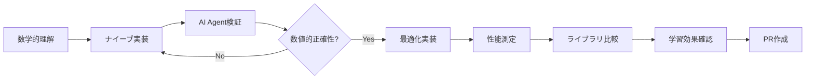

# 🐝 Bee — AI Agent駆動ニューラルネットワーク実装プロジェクト

**Bee**は、AI Agent駆動開発により段階的にニューラルネットワークを実装・学習するプロジェクトです。パーセプトロンから大規模言語モデル（LLM）まで、検証可能なマイルストーンを通じて進化します。

---

## 🎯 プロジェクト目標

### 技術的目標
- **段階的実装**: パーセプトロン → MLP → CNN/RNN → Attention → LLM
- **性能最適化**: ベースライン比較による定量的改善測定
- **AI Agent駆動**: 95%以上の開発タスクをAI Agentが自動実行
- **再現可能性**: 全実装の自動テスト・検証を保証

### 学習目標  
- ニューラルネットワークアーキテクチャの段階的理解
- 最適化技術の定量的効果測定
- MLOpsとAI Agent駆動開発の実践
- **ライブラリ依存を避けたアルゴリズム本質学習**

## 🏗 技術スタック（学習最適化重視）

| 領域 | 技術選択 | 学習目的での理由 |
|-----|---------|------|
| **Core Language** | Go 1.21+ | **ライブラリ非依存学習・明示的実装強制・型安全性** |
| **数値計算** | 自実装 → gonum | **アルゴリズム理解→最適化の段階的学習** |
| **GPU計算** | 低レベルbindings | **並列計算の本質理解** |
| **CLI Framework** | 自実装 → cobra | **コマンド処理の基礎→フレームワーク理解** |
| **テスト** | testing + 数値検証 | **アルゴリズム正確性の定量確認** |
| **CI/CD** | GitHub Actions | **自動化パイプライン学習** |

### 🧠 Go言語選択の学習価値

#### ✅ 学習効果最大化の根拠
1. **ライブラリ依存回避**: 高レベルMLライブラリ禁止によるアルゴリズム本質学習
2. **明示的実装強制**: フレームワークのブラックボックス化を回避
3. **段階的理解**: 低レベル実装→最適化→ライブラリ比較の学習曲線
4. **型安全学習**: 数値計算での型安全性とエラーハンドリング習得
5. **並行処理学習**: ゴルーチンでのニューラル並列処理理解

#### 🚫 「ライブラリ丸投げ」回避戦略
```go
// ❌ 学習効果ゼロパターン
result := tensorflow.Predict(input)

// ✅ 学習効果最大パターン  
weightedSum := bias
for i, weight := range weights {
    weightedSum += input[i] * weight  // 明示的計算
}
output := sigmoid(weightedSum)  // 自実装活性化関数
```

---

## 📊 Phase構成と成果物定義

各Phaseは**検証可能な成果物**と**定量的完了条件**により定義されます。

### Phase 1.0: パーセプトロン基盤 🔴
**期間**: 2-3週間 | **自動化レベル**: 90% | **学習重視度**: ⭐⭐⭐⭐⭐

| 成果物 | 完了条件 | 学習目標 | 検証方法 |
|-------|---------|---------|---------|
| **ナイーブ実装** | XOR問題解決（精度95%+） | 重み更新の数学的理解 | `make test-phase1` |
| **最適化実装** | 推論時間1ms以下 | 性能改善手法理解 | ベンチマーク比較 |
| **CLI自実装** | train/inferコマンド動作 | コマンド処理基礎理解 | E2Eテスト |
| **数値検証** | 既知解との誤差<1e-6 | アルゴリズム正確性確認 | 数値テスト |

#### 🎯 学習効果重視実装
```go
// Phase 1.0 必須実装パターン
type Perceptron struct {
    weights      []float64  // 重み（明示的管理）
    bias         float64    // バイアス項
    learningRate float64    // 学習率
}

// 数学的背景: y = σ(w·x + b)
func (p *Perceptron) Forward(x []float64) float64 {
    // Step-by-step実装で理解を深める
    sum := p.bias
    for i, weight := range p.weights {
        sum += weight * x[i]  // 内積計算の明示
    }
    return stepFunction(sum)  // 活性化関数も自実装
}
```

### Phase 1.1: MLP実装 🔶  
**期間**: 3-4週間 | **自動化レベル**: 85% | **学習重視度**: ⭐⭐⭐⭐⭐

| 成果物 | 完了条件 | 学習目標 | 検証方法 |
|-------|---------|---------|---------|
| **誤差逆伝播自実装** | 数値勾配との差<1e-6 | 勾配計算の数学的理解 | 単体テスト |
| **多層ネットワーク** | MNIST 90%精度達成 | 非線形分離能力理解 | 自動精度測定 |
| **活性化関数群** | sigmoid/ReLU/tanh自実装 | 非線形変換の効果理解 | 関数特性テスト |
| **学習曲線分析** | 収束・過学習検証 | 最適化動力学理解 | 統合テスト |

### Phase 2.0-4.0: 高度アーキテクチャ
- **Phase 2.0**: CNN/RNN (画像・系列処理の本質理解)
- **Phase 3.0**: Attention/Transformer (注意機構の数学的理解)
- **Phase 4.0**: LLM (大規模モデル・分散学習)

## 🤖 AI Agent駆動開発フロー（学習最適化）

### 学習重視自動化レベル定義

| Level | 自動化対象 | 学習要素 | 人間の役割 |
|-------|----------|---------|----------|
| **Level 1** (完全自動) | テストコード生成、ドキュメント、品質チェック | 実装パターン学習 | 監視・承認 |
| **Level 2** (学習支援) | 数式→コード変換、最適化提案 | アルゴリズム理解支援 | 数学的正確性確認 |
| **Level 3** (人間主導) | 数学的背景、アーキテクチャ、学習効果評価 | 理論理解・戦略決定 | 学習方針決定 |

### 🎓 学習効果最大化ワークフロー



---

## 🔧 開発環境セットアップ

### 前提条件
```bash
# 必須
Go 1.21+
Git 2.30+
Make 4.0+

# GPU計算用（オプション）
CUDA 11.8+ or OpenCL 2.0+
```

### クイックスタート
```bash
# リポジトリクローン・セットアップ
git clone https://github.com/nyasuto/bee
cd bee
make setup

# Phase 1開発環境準備
make phase1

# 開発開始
make dev
```

### 品質保証
```bash
# 包括的品質チェック
make quality

# 自動修正付きチェック  
make quality-fix

# ベンチマーク実行
make benchmark
```

---

## 🚀 使用例

```bash
# Phase 1: パーセプトロン
bee train --model=perceptron --data=datasets/xor.csv --output=models/xor.model
bee infer --model=models/xor.model --input="1,1" --expect=0

# Phase 2: CNN
bee train --model=cnn --dataset=mnist --epochs=10 --gpu
bee benchmark --model=cnn --dataset=mnist --iterations=1000

# Phase 3: Transformer  
bee train --model=transformer --task=translation --src=en --tgt=ja
bee infer --model=models/translator.model --text="Hello world"

# 性能比較
bee compare --models=perceptron,mlp,cnn --dataset=mnist
```

---

## 📈 性能評価フレームワーク

### ベースライン定義
| 実装 | 環境 | 用途 |
|-----|------|------|
| PyTorch equivalent | Python 3.9 + CUDA | 標準比較 |
| Naive Go | 最適化前実装 | 改善効果測定 |
| 産業実装 | TensorRT等 | 実用性評価 |

### 評価指標
- **性能**: 推論時間、学習時間、メモリ使用量、エネルギー効率
- **品質**: 精度、収束速度、数値安定性
- **開発性**: 実装速度、保守性、テストカバレッジ

### 自動ベンチマーク
```bash
# 継続的性能監視
make benchmark-continuous

# リグレッション検出
make benchmark-regression

# 結果可視化
make benchmark-dashboard
```

## 📋 成功指標

### プロジェクト成功の定量的基準
- [ ] 全Phase完了（定義された成果物達成）
- [ ] AI Agent自動化率95%以上達成
- [ ] テストカバレッジ90%以上維持
- [ ] ベースライン比較で性能改善実証
- [ ] 継続的CI/CD稼働率99%以上

### 学習成果の検証
- [ ] 各アーキテクチャの実装原理理解
- [ ] 最適化技術の定量的効果測定
- [ ] AIエンジニアリングプロセス習得

---

## 🤝 コントリビューション

### AI Agent駆動開発への参加
1. **Issue確認**: [Project Issues](https://github.com/nyasuto/bee/issues)で現在の課題確認
2. **ブランチ作成**: 適切な命名規則でブランチ作成（`feat/phase1-perceptron`等）
3. **実装**: CLAUDE.mdのガイドラインに従って実装
4. **品質確認**: `make pr-ready`で品質チェック
5. **PR作成**: 自動テスト通過後、レビュー依頼

### 人間レビューポイント  
- 技術的方向性の妥当性
- アーキテクチャ設計の検証
- 性能最適化戦略の評価

---

## 📚 関連ドキュメント

- [CLAUDE.md](./CLAUDE.md) - AI Agent開発ガイドライン
- [GitHub Issues](https://github.com/nyasuto/bee/issues) - プロジェクト課題・改善提案
- [docs/architecture.md](./docs/architecture.md) - システム設計詳細
- [docs/performance.md](./docs/performance.md) - 性能評価・最適化

---

## 🐝 プロジェクトの意味

> **Bee** = 小さな知能（ニューロン）が群れで協調し、巨大な知能（LLM）を形成
> 
> AI Agentと協調して、段階的実装により**アルゴリズムの本質理解**を重視した
> ニューラルネットワーク学習を通じて、次世代AIエンジニアリングを実践する

**🚀 AI Agentと共に、一歩ずつ確実に、深層学習の世界を征服しよう！**
