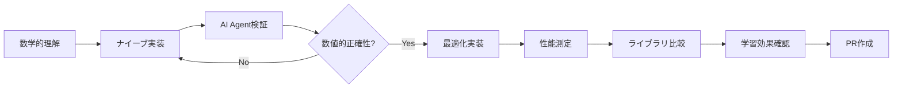

# 🐝 Bee — AI Agent駆動ニューラルネットワーク実装プロジェクト

**Bee**は、AI Agent駆動開発により段階的にニューラルネットワークを実装・学習するプロジェクトです。パーセプトロンから大規模言語モデル（LLM）まで、検証可能なマイルストーンを通じて進化します。

---

## 🎯 プロジェクト目標

### 技術的目標
- **段階的実装**: パーセプトロン → MLP → CNN/RNN → Attention → LLM
- **性能最適化**: ベースライン比較による定量的改善測定
- **AI Agent駆動**: 95%以上の開発タスクをAI Agentが自動実行
- **再現可能性**: 全実装の自動テスト・検証を保証

### 学習目標  
- ニューラルネットワークアーキテクチャの段階的理解
- 最適化技術の定量的効果測定
- MLOpsとAI Agent駆動開発の実践
- **ライブラリ依存を避けたアルゴリズム本質学習**

## 🏗 技術スタック（学習最適化重視）

| 領域 | 技術選択 | 学習目的での理由 |
|-----|---------|------|
| **Core Language** | Go 1.21+ | **ライブラリ非依存学習・明示的実装強制・型安全性** |
| **数値計算** | 自実装 → gonum | **アルゴリズム理解→最適化の段階的学習** |
| **GPU計算** | 低レベルbindings | **並列計算の本質理解** |
| **CLI Framework** | 自実装 → cobra | **コマンド処理の基礎→フレームワーク理解** |
| **テスト** | testing + 数値検証 | **アルゴリズム正確性の定量確認** |
| **CI/CD** | GitHub Actions | **自動化パイプライン学習** |

### 🧠 Go言語選択の学習価値

#### ✅ 学習効果最大化の根拠
1. **ライブラリ依存回避**: 高レベルMLライブラリ禁止によるアルゴリズム本質学習
2. **明示的実装強制**: フレームワークのブラックボックス化を回避
3. **段階的理解**: 低レベル実装→最適化→ライブラリ比較の学習曲線
4. **型安全学習**: 数値計算での型安全性とエラーハンドリング習得
5. **並行処理学習**: ゴルーチンでのニューラル並列処理理解

#### 🚫 「ライブラリ丸投げ」回避戦略
```go
// ❌ 学習効果ゼロパターン
result := tensorflow.Predict(input)

// ✅ 学習効果最大パターン  
weightedSum := bias
for i, weight := range weights {
    weightedSum += input[i] * weight  // 明示的計算
}
output := sigmoid(weightedSum)  // 自実装活性化関数
```

---

## 📊 Phase構成と成果物定義

各Phaseは**検証可能な成果物**と**定量的完了条件**により定義されます。

### Phase 1.0: パーセプトロン基盤 🔴
**期間**: 2-3週間 | **自動化レベル**: 90% | **学習重視度**: ⭐⭐⭐⭐⭐

| 成果物 | 完了条件 | 学習目標 | 検証方法 |
|-------|---------|---------|---------|
| **ナイーブ実装** | XOR問題解決（精度95%+） | 重み更新の数学的理解 | `make test-phase1` |
| **最適化実装** | 推論時間1ms以下 | 性能改善手法理解 | ベンチマーク比較 |
| **CLI自実装** | train/inferコマンド動作 | コマンド処理基礎理解 | E2Eテスト |
| **数値検証** | 既知解との誤差<1e-6 | アルゴリズム正確性確認 | 数値テスト |

#### 🎯 学習効果重視実装
```go
// Phase 1.0 必須実装パターン
type Perceptron struct {
    weights      []float64  // 重み（明示的管理）
    bias         float64    // バイアス項
    learningRate float64    // 学習率
}

// 数学的背景: y = σ(w·x + b)
func (p *Perceptron) Forward(x []float64) float64 {
    // Step-by-step実装で理解を深める
    sum := p.bias
    for i, weight := range p.weights {
        sum += weight * x[i]  // 内積計算の明示
    }
    return stepFunction(sum)  // 活性化関数も自実装
}
```

### Phase 1.1: MLP実装 🔶  
**期間**: 3-4週間 | **自動化レベル**: 85% | **学習重視度**: ⭐⭐⭐⭐⭐

| 成果物 | 完了条件 | 学習目標 | 検証方法 |
|-------|---------|---------|---------|
| **誤差逆伝播自実装** | 数値勾配との差<1e-6 | 勾配計算の数学的理解 | 勾配チェック自動テスト |
| **活性化関数群** | sigmoid/ReLU/tanh自実装 | 非線形変換の効果理解 | 微分・積分テスト自動化 |
| **MNIST分類器** | 90%精度達成 | 非線形分離能力理解 | 自動精度測定 |
| **学習曲線分析** | 収束・過学習検証 | 最適化動力学理解 | 統計的分析 |
| **重み可視化** | 隠れ層重み分析 | 特徴抽出確認 | 可視化自動生成 |

#### 🎯 誤差逆伝播の段階的実装
```go
// 学習効果最大化：逆伝播を明示的実装
func (mlp *MLP) Backprop(target []float64) {
    // Phase 1: 出力層誤差（δ^L = ∇_a C ⊙ σ'(z^L)）
    outputError := make([]float64, len(mlp.output))
    for i := range outputError {
        outputError[i] = (mlp.output[i] - target[i]) * 
            sigmoidDerivative(mlp.preActivation[len(mlp.layers)-1][i])
    }
    
    // Phase 2: 隠れ層誤差（δ^l = ((W^{l+1})^T δ^{l+1}) ⊙ σ'(z^l)）
    for l := len(mlp.layers) - 2; l >= 0; l-- {
        layerError := make([]float64, len(mlp.layers[l]))
        for i := range layerError {
            sum := 0.0
            for j := range mlp.layers[l+1] {
                sum += mlp.weights[l+1][j][i] * mlp.errors[l+1][j]
            }
            layerError[i] = sum * sigmoidDerivative(mlp.preActivation[l][i])
        }
        mlp.errors[l] = layerError
    }
    
    // Phase 3: 重み更新（∂C/∂w^l_{jk} = a^{l-1}_k δ^l_j）
    for l := 0; l < len(mlp.weights); l++ {
        for j := range mlp.weights[l] {
            for k := range mlp.weights[l][j] {
                gradient := mlp.activations[l][k] * mlp.errors[l+1][j]
                mlp.weights[l][j][k] -= mlp.learningRate * gradient
            }
        }
    }
}
```

### Phase 2.0: CNN/RNN実装 🔶
**期間**: 4-6週間 | **自動化レベル**: 80% | **学習重視度**: ⭐⭐⭐⭐

| 成果物 | 完了条件 | 学習目標 | 検証方法 |
|-------|---------|---------|---------|
| **畳み込み層自実装** | CIFAR-10 70%精度 | 畳み込み演算の数学的理解 | 特徴マップ可視化 |
| **RNN/LSTM自実装** | 系列予測タスク実装 | 時系列処理の本質理解 | 勾配フロー自動検証 |
| **データ拡張** | バッチ処理対応 | 汎化性能向上確認 | 前処理パイプライン自動化 |
| **正則化技術** | 過学習抑制確認 | Dropout・Batch Normalization理解 | 検証精度モニタリング |

#### 🎯 畳み込み演算の明示的実装
```go
// 畳み込み演算の学習重視実装
func (conv *ConvLayer) Forward(input [][][]float64) [][][]float64 {
    // input: [height][width][channels]
    // kernel: [kH][kW][inChannels][outChannels]
    
    outHeight := (len(input)-conv.kernelSize)/conv.stride + 1
    outWidth := (len(input[0])-conv.kernelSize)/conv.stride + 1
    output := make([][][]float64, outHeight)
    
    for h := 0; h < outHeight; h++ {
        output[h] = make([][]float64, outWidth)
        for w := 0; w < outWidth; w++ {
            output[h][w] = make([]float64, conv.outChannels)
            
            // 各出力チャンネルに対して畳み込み実行
            for oc := 0; oc < conv.outChannels; oc++ {
                sum := 0.0
                // カーネル範囲での畳み込み計算
                for kh := 0; kh < conv.kernelSize; kh++ {
                    for kw := 0; kw < conv.kernelSize; kw++ {
                        for ic := 0; ic < conv.inChannels; ic++ {
                            inputH := h*conv.stride + kh
                            inputW := w*conv.stride + kw
                            sum += input[inputH][inputW][ic] * 
                                   conv.kernel[kh][kw][ic][oc]
                        }
                    }
                }
                output[h][w][oc] = sum + conv.bias[oc]
            }
        }
    }
    return output
}
```

### Phase 3.0: Attention/Transformer実装 🔵
**期間**: 6-8週間 | **自動化レベル**: 70% | **学習重視度**: ⭐⭐⭐⭐

| 成果物 | 完了条件 | 学習目標 | 検証方法 |
|-------|---------|---------|---------|
| **Self-Attention自実装** | 注意重み可視化 | Query・Key・Valueの数学的理解 | 注意パターン分析 |
| **Multi-Head Attention** | 並列注意統合 | 複数視点での特徴抽出理解 | ヘッド別特徴分析 |
| **Transformer実装** | 翻訳タスク基本性能 | Encoder・Decoder構造理解 | E2Eテスト |
| **位置エンコーディング** | 系列位置情報埋め込み | 位置情報の数学的表現理解 | 位置依存性テスト |

#### 🎯 Self-Attentionの明示的実装
```go
// Self-Attention機構の学習重視実装
func (sa *SelfAttention) Forward(x [][]float64) [][]float64 {
    seqLen, dimModel := len(x), len(x[0])
    
    // Step 1: Query, Key, Value行列の計算
    Q := make([][]float64, seqLen)
    K := make([][]float64, seqLen)
    V := make([][]float64, seqLen)
    
    for i := 0; i < seqLen; i++ {
        Q[i] = matmul(x[i], sa.WQ)  // Q = X * W_Q
        K[i] = matmul(x[i], sa.WK)  // K = X * W_K  
        V[i] = matmul(x[i], sa.WV)  // V = X * W_V
    }
    
    // Step 2: Scaled Dot-Product Attention
    // Attention(Q,K,V) = softmax(QK^T / √d_k)V
    scores := make([][]float64, seqLen)
    for i := 0; i < seqLen; i++ {
        scores[i] = make([]float64, seqLen)
        for j := 0; j < seqLen; j++ {
            // 内積計算: Q_i · K_j
            dot := 0.0
            for k := 0; k < sa.dimK; k++ {
                dot += Q[i][k] * K[j][k]
            }
            scores[i][j] = dot / math.Sqrt(float64(sa.dimK))  // スケーリング
        }
    }
    
    // Step 3: Softmax正規化
    attentionWeights := softmax2D(scores)
    
    // Step 4: Value重み付け和
    output := make([][]float64, seqLen)
    for i := 0; i < seqLen; i++ {
        output[i] = make([]float64, sa.dimV)
        for j := 0; j < sa.dimV; j++ {
            sum := 0.0
            for k := 0; k < seqLen; k++ {
                sum += attentionWeights[i][k] * V[k][j]
            }
            output[i][j] = sum
        }
    }
    
    return output
}
```

### Phase 4.0: LLM実装 🟣
**期間**: 8-12週間 | **自動化レベル**: 60% | **学習重視度**: ⭐⭐⭐

| 成果物 | 完了条件 | 学習目標 | 検証方法 |
|-------|---------|---------|---------|
| **スケーラブルLLM** | 分散学習対応 | データ並列・モデル並列理解 | 分散性能テスト |
| **Flash Attention** | メモリ効率化 | 注意計算最適化理解 | メモリ使用量測定 |
| **Mixed Precision** | 学習高速化 | 数値精度と性能トレードオフ | 精度劣化テスト |
| **モデル配布** | HuggingFace互換 | モデル標準化・互換性理解 | 統合テスト |

## 🤖 AI Agent駆動開発フロー（学習最適化）

### 学習重視自動化レベル定義

| Level | 自動化対象 | 学習要素 | 人間の役割 |
|-------|----------|---------|----------|
| **Level 1** (完全自動) | 数学的仕様→Go実装、テスト・ベンチマーク生成、可視化 | 実装パターン学習 | 監視・承認 |
| **Level 2** (学習支援) | 数式→コード変換、最適化提案、数値安定性改善 | アルゴリズム理解支援 | 数学的正確性確認 |
| **Level 3** (人間主導) | 数学的背景、アーキテクチャ設計、学習効果評価 | 理論理解・戦略決定 | 学習方針決定 |

#### 🤖 AI Agent自動化戦略詳細

##### Level 1 (完全自動): 95%自動化対象
- **コード骨格生成**: 数学的仕様からGo実装への自動変換
- **テスト生成**: 
  - 単体テスト・統合テスト自動生成
  - 数値検証テスト（既知解との比較）
  - 勾配チェック・微分テスト
- **性能測定**: ベンチマーク・プロファイリング自動実行
- **可視化**: 学習曲線・決定境界・注意重み等の自動生成
- **ドキュメント**: 数学的背景・実装詳細の自動記述

##### Level 2 (学習支援): AI Agent最適化提案
- **実装効率化**: 学習効果維持した計算最適化
- **数値安定性**: オーバーフロー・アンダーフロー対策
- **メモリ最適化**: 大規模データ処理の効率化  
- **並列化機会**: ゴルーチンでの並列計算特定

##### Level 3 (人間主導): 学習効果確認必須
- **数学的正確性**: 理論値との最終確認
- **学習理解度**: 実装原理の理解度評価
- **アーキテクチャ**: 設計決定・トレードオフ判断
- **Phase進行**: 次段階への移行タイミング判断

### 🎓 学習効果最大化ワークフロー



#### 🧪 学習効果検証フレームワーク

##### 必須検証項目（各Phase共通）
1. **理論理解テスト**: 数式導出・アルゴリズム説明の正確性
2. **実装理解テスト**: コード説明・設計判断理由の妥当性
3. **数値精度テスト**: 既知解・理論値との比較（誤差<1e-6）
4. **性能分析テスト**: 最適化前後の定量比較・ボトルネック特定
5. **汎化能力テスト**: 未知データでの性能確認・過学習検証

##### Phase進行条件
- ✅ 全成果物の完了条件達成
- ✅ 学習効果検証テスト全通過  
- ✅ AI Agent自動化タスク95%達成
- ✅ 人間レビューでの理解度確認

---

## 🔧 ネイティブ開発環境セットアップ

### 前提条件
```bash
# 必須
Go 1.21+
Git 2.30+
Make 4.0+

# GPU計算用（オプション）
CUDA 11.8+ or OpenCL 2.0+
```

### 🚀 クイックスタート

```bash
# 1. リポジトリクローン
git clone https://github.com/nyasuto/bee
cd bee

# 2. ネイティブ開発環境セットアップ
make setup-native

# 3. Phase 1開発環境準備  
make phase1

# 4. 開発開始
make dev
```

### 📋 セットアップ詳細

#### 基本セットアップ
```bash
# Go依存関係のみインストール
make setup

# 開発ツール含む完全セットアップ（推奨）
make setup-native

# 環境検証
make verify-env
```

#### 個別ツールインストール
```bash
# Go開発ツールのみインストール
make install-tools

# Git hookのみセットアップ
make git-hooks
```

### 品質保証
```bash
# 包括的品質チェック
make quality

# 自動修正付きチェック  
make quality-fix

# ベンチマーク実行
make benchmark
```

### 💻 各プラットフォーム固有の注意点

#### macOS
```bash
# Homebrewでのツールインストール（推奨）
brew install go git make

# ARM Mac特記事項
# - Go 1.21+ はARM64ネイティブ対応済み
# - GPU計算にはMetal Performance Shadersが利用可能
```

#### Linux (Ubuntu/Debian)
```bash
# パッケージマネージャでのインストール
sudo apt update
sudo apt install golang-go git make build-essential

# GPU対応（NVIDIA）
sudo apt install nvidia-cuda-toolkit
```

#### Windows
```bash
# Git Bash or WSL2を推奨
# Go公式インストーラーまたはchocolateyを利用
choco install golang git make
```

---

## 🚀 使用例

```bash
# Phase 1: パーセプトロン
bee train --model=perceptron --data=datasets/xor.csv --output=models/xor.model
bee infer --model=models/xor.model --input="1,1" --expect=0

# Phase 2: CNN
bee train --model=cnn --dataset=mnist --epochs=10 --gpu
bee benchmark --model=cnn --dataset=mnist --iterations=1000

# Phase 3: Transformer  
bee train --model=transformer --task=translation --src=en --tgt=ja
bee infer --model=models/translator.model --text="Hello world"

# 性能比較
bee compare --models=perceptron,mlp,cnn --dataset=mnist
```

---

## 📈 性能評価フレームワーク

### ベースライン定義
| 実装 | 環境 | 用途 |
|-----|------|------|
| PyTorch equivalent | Python 3.9 + CUDA | 標準比較 |
| Naive Go | 最適化前実装 | 改善効果測定 |
| 産業実装 | TensorRT等 | 実用性評価 |

### 評価指標
- **性能**: 推論時間、学習時間、メモリ使用量、エネルギー効率
- **品質**: 精度、収束速度、数値安定性
- **開発性**: 実装速度、保守性、テストカバレッジ

### 自動ベンチマーク
```bash
# 継続的性能監視
make benchmark-continuous

# リグレッション検出
make benchmark-regression

# 結果可視化
make benchmark-dashboard
```

## 📋 成功指標

### プロジェクト成功の定量的基準
- [ ] 全Phase完了（定義された成果物達成）
- [ ] AI Agent自動化率95%以上達成
- [ ] テストカバレッジ90%以上維持
- [ ] ベースライン比較で性能改善実証
- [ ] 継続的CI/CD稼働率99%以上

### 学習成果の検証
- [ ] 各アーキテクチャの実装原理理解
- [ ] 最適化技術の定量的効果測定
- [ ] AIエンジニアリングプロセス習得

---

## 🤝 コントリビューション

### AI Agent駆動開発への参加
1. **Issue確認**: [Project Issues](https://github.com/nyasuto/bee/issues)で現在の課題確認
2. **ブランチ作成**: 適切な命名規則でブランチ作成（`feat/phase1-perceptron`等）
3. **実装**: CLAUDE.mdのガイドラインに従って実装
4. **品質確認**: `make pr-ready`で品質チェック
5. **PR作成**: 自動テスト通過後、レビュー依頼

### 人間レビューポイント  
- 技術的方向性の妥当性
- アーキテクチャ設計の検証
- 性能最適化戦略の評価

---

## 📚 関連ドキュメント

- [CLAUDE.md](./CLAUDE.md) - AI Agent開発ガイドライン
- [GitHub Issues](https://github.com/nyasuto/bee/issues) - プロジェクト課題・改善提案
- [docs/architecture.md](./docs/architecture.md) - システム設計詳細
- [docs/performance.md](./docs/performance.md) - 性能評価・最適化

---

## 🐝 プロジェクトの意味

> **Bee** = 小さな知能（ニューロン）が群れで協調し、巨大な知能（LLM）を形成
> 
> AI Agentと協調して、段階的実装により**アルゴリズムの本質理解**を重視した
> ニューラルネットワーク学習を通じて、次世代AIエンジニアリングを実践する

**🚀 AI Agentと共に、一歩ずつ確実に、深層学習の世界を征服しよう！**
