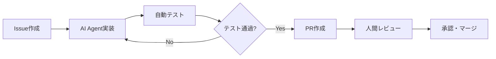

# 🐝 Bee — AI Agent駆動ニューラルネットワーク実装プロジェクト

**Bee**は、AI Agent駆動開発により段階的にニューラルネットワークを実装・学習するプロジェクトです。パーセプトロンから大規模言語モデル（LLM）まで、検証可能なマイルストーンを通じて進化します。

---

## 🎯 プロジェクト目標

### 技術的目標
- **段階的実装**: パーセプトロン → MLP → CNN/RNN → Attention → LLM
- **性能最適化**: ベースライン比較による定量的改善測定
- **AI Agent駆動**: 95%以上の開発タスクをAI Agentが自動実行
- **再現可能性**: 全実装の自動テスト・検証を保証

### 学習目標  
- ニューラルネットワークアーキテクチャの段階的理解
- 最適化技術の定量的効果測定
- MLOpsとAI Agent駆動開発の実践

---

## 🏗 技術スタック

| 領域 | 技術選択 | 理由 |
|-----|---------|------|
| **Core Language** | Go 1.21+ | 学習目的・並行処理・型安全性 |
| **数値計算** | gonum + BLAS | Go生態系での最適解 |
| **GPU計算** | OpenCL/CUDA bindings | 高性能計算サポート |
| **CLI Framework** | cobra | 統一的なコマンドインターフェース |
| **テスト** | testing + testify | 標準+拡張テストフレームワーク |
| **CI/CD** | GitHub Actions | 自動化パイプライン |

> **Note**: Go言語選択は [Issue #1](https://github.com/nyasuto/bee/issues/1) で技術的妥当性を検討中

---

## 📊 Phase構成と成果物定義

各Phaseは**検証可能な成果物**と**定量的完了条件**により定義されます。

### Phase 1.0: パーセプトロン基盤 🔴
**期間**: 2-3週間 | **自動化レベル**: 90%

| 成果物 | 完了条件 | 検証方法 |
|-------|---------|---------|
| 単層パーセプトロン実装 | XOR問題解決（精度95%+） | `make test-phase1` |
| CLI基本機能 | train/inferコマンド動作 | E2Eテスト |
| ベンチマークフレームワーク | 推論時間1ms以下 | 自動ベンチマーク |

**自動化対象**: コード生成、テスト実装、ドキュメント  
**人間判断**: アーキテクチャ設計レビュー

### Phase 1.1: MLP実装 🔶  
**期間**: 3-4週間 | **自動化レベル**: 85%

| 成果物 | 完了条件 | 検証方法 |
|-------|---------|---------|
| 多層パーセプトロン | MNIST 90%精度達成 | 自動精度測定 |
| 誤差逆伝播 | 数値勾配との差<1e-6 | 単体テスト |
| 学習曲線可視化 | 収束検証機能 | 統合テスト |

### Phase 2.0: CNN/RNN 🔶
**期間**: 4-6週間 | **自動化レベル**: 80%

| 成果物 | 完了条件 | 検証方法 |
|-------|---------|---------|
| CNN実装 | CIFAR-10 70%精度 | 自動評価 |
| RNN実装 | 系列予測タスク実装 | 機能テスト |
| データローダー | バッチ処理対応 | 性能テスト |

### Phase 3.0: Attention/Transformer 🔵
**期間**: 6-8週間 | **自動化レベル**: 70%

| 成果物 | 完了条件 | 検証方法 |
|-------|---------|---------|
| Self-Attention | 注意重み可視化 | 統合テスト |
| Transformer実装 | 翻訳タスク基本性能 | E2Eテスト |
| 位置エンコーディング | 標準実装との一致 | 単体テスト |

### Phase 4.0: LLM 🟣
**期間**: 8-12週間 | **自動化レベル**: 60%

| 成果物 | 完了条件 | 検証方法 |
|-------|---------|---------|
| スケーラブルLLM | 分散学習対応 | 性能テスト |
| 最適化技術 | Flash Attention等 | ベンチマーク |
| モデル配布 | HuggingFace互換 | 統合テスト |

---

## 🤖 AI Agent駆動開発フロー

### 自動化レベル定義

| Level | 自動化対象 | 人間の役割 |
|-------|----------|----------|
| **Level 1** (完全自動) | コード生成、テスト、ドキュメント、バグ修正 | 監視・承認 |
| **Level 2** (半自動) | 性能最適化、アーキテクチャ提案 | 設計判断 |
| **Level 3** (人間主導) | 技術的方向性、PR承認、リリース | 戦略決定 |

### 開発ワークフロー



---

## 🔧 開発環境セットアップ

### 前提条件
```bash
# 必須
Go 1.21+
Git 2.30+
Make 4.0+

# GPU計算用（オプション）
CUDA 11.8+ or OpenCL 2.0+
```

### クイックスタート
```bash
# リポジトリクローン・セットアップ
git clone https://github.com/user/bee
cd bee
make setup

# Phase 1開発環境準備
make phase1

# 開発開始
make dev
```

### 品質保証
```bash
# 包括的品質チェック
make quality

# 自動修正付きチェック  
make quality-fix

# ベンチマーク実行
make benchmark
```

---

## 📈 性能評価フレームワーク

### ベースライン定義
| 実装 | 環境 | 用途 |
|-----|------|------|
| PyTorch equivalent | Python 3.9 + CUDA | 標準比較 |
| Naive Go | 最適化前実装 | 改善効果測定 |
| 産業実装 | TensorRT等 | 実用性評価 |

### 評価指標
- **性能**: 推論時間、学習時間、メモリ使用量、エネルギー効率
- **品質**: 精度、収束速度、数値安定性
- **開発性**: 実装速度、保守性、テストカバレッジ

### 自動ベンチマーク
```bash
# 継続的性能監視
make benchmark-continuous

# リグレッション検出
make benchmark-regression

# 結果可視化
make benchmark-dashboard
```

---

## 🚀 使用例

```bash
# Phase 1: パーセプトロン
bee train --model=perceptron --data=datasets/xor.csv --output=models/xor.model
bee infer --model=models/xor.model --input="1,1" --expect=0

# Phase 2: CNN
bee train --model=cnn --dataset=mnist --epochs=10 --gpu
bee benchmark --model=cnn --dataset=mnist --iterations=1000

# Phase 3: Transformer  
bee train --model=transformer --task=translation --src=en --tgt=ja
bee infer --model=models/translator.model --text="Hello world"

# 性能比較
bee compare --models=perceptron,mlp,cnn --dataset=mnist
```

---

## 📋 成功指標

### プロジェクト成功の定量的基準
- [ ] 全Phase完了（定義された成果物達成）
- [ ] AI Agent自動化率95%以上達成
- [ ] テストカバレッジ90%以上維持
- [ ] ベースライン比較で性能改善実証
- [ ] 継続的CI/CD稼働率99%以上

### 学習成果の検証
- [ ] 各アーキテクチャの実装原理理解
- [ ] 最適化技術の定量的効果測定
- [ ] AIエンジニアリングプロセス習得

---

## 🤝 コントリビューション

### AI Agent駆動開発への参加
1. **Issue確認**: [Project Issues](https://github.com/user/bee/issues)で現在の課題確認
2. **ブランチ作成**: 適切な命名規則でブランチ作成（`feat/phase1-perceptron`等）
3. **実装**: CLAUDE.mdのガイドラインに従って実装
4. **品質確認**: `make pr-ready`で品質チェック
5. **PR作成**: 自動テスト通過後、レビュー依頼

### 人間レビューポイント  
- 技術的方向性の妥当性
- アーキテクチャ設計の検証
- 性能最適化戦略の評価

---

## 📚 関連ドキュメント

- [CLAUDE.md](./CLAUDE.md) - AI Agent開発ガイドライン
- [docs/architecture.md](./docs/architecture.md) - システム設計詳細
- [docs/performance.md](./docs/performance.md) - 性能評価・最適化
- [docs/ai-agent-workflow.md](./docs/ai-agent-workflow.md) - AI Agent開発プロセス

---

**🐝 Bee - AI Agentと協調して、段階的に学ぶニューラルネットワーク実装を通じて、次世代AIエンジニアリングを実践しよう！**